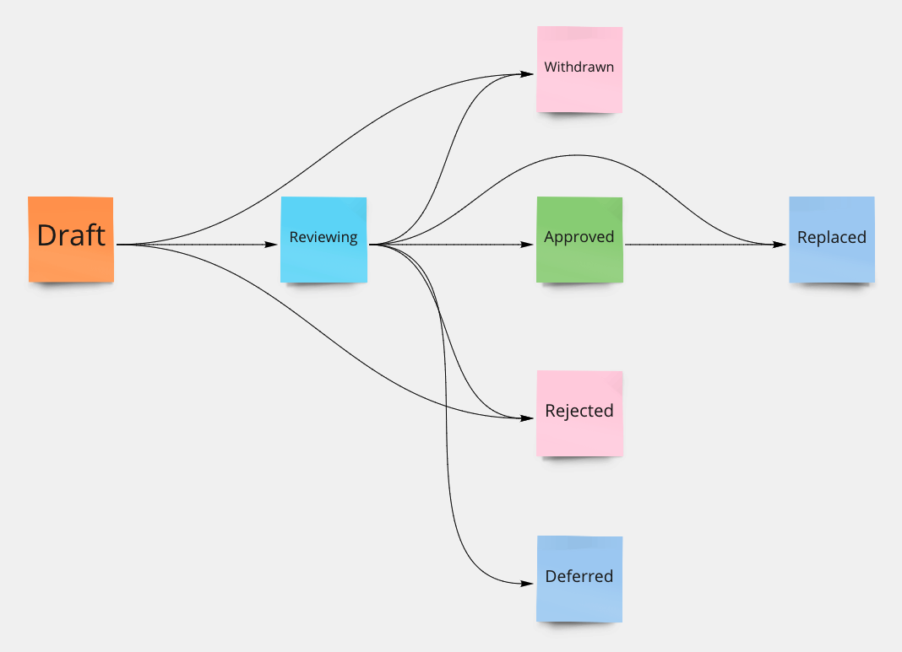

# ADR Purpose and Guidelines

TODO: add purpose

## Domain-specific ADRs

Some ADRs may be specific to a particular domain (for example, only to APIs
within a certain programming language, or even a certain team). In this
situation, the group will be given a particular block of ADRs to use in
accordance with [ADR#2](../2/README.md), and the applicable ADRs will clearly
indicate their scope.

## States

At any given time, ADRs may exist in a variety of states as they work their way
through the process. The following is a summary of each state.

### Draft

The initial state for an ADR is the "Draft" state. This means that the ADR is
being discussed and iterated upon, primarily by the original authors. While the
editors may get involved at this stage, it is not necessary.

> If significant, high-level iteration is required, it is recommended to
> draft ADRs in a Google doc instead of a PR.

### Reviewing

Once discussion on an ADR has generally concluded, but before it is formally
accepted it moves to the "Reviewing" state. This means that the authors have
reached a general consensus on the proposal and the editors are now involved.
At this stage the editors may request changes or suggest alternatives to the
proposal before moving forward.

> As a formal matter, one ADR approver (other than the author) **must** provide
> formal signoff to advance an ADR to the reviewing state. Additionally, there
> **must not** be formal objections ("changes requested" on the GitHub PR) from
> other approvers.

### Approved

Once an approved ADR has been agreed upon, it enters "approved" state and is
considered "best current practice".

> As a formal matter, two ADR approvers (other than the author) must provide
> formal signoff to advance an ADR to the approved state. Additionally, there
> must not be formal objections ("changes requested" on the GitHub PR) from
> other approvers.

### Withdrawn

If an ADR is withdrawn by the author or champion, it enters "withdrawn" state.
ADRs that are withdrawn may be taken up by another champion.

### Rejected

If an ADR is rejected by the ADR editors, it enters "rejected" state. ADRs that
are rejected remain, and provide documentation and reference to inform future
discussions.

### Deferred

If an ADR has not been acted upon for a significant period of time, the editors
may mark it as "deferred".

### Replaced

If an ADR has been replaced by another ADR, it enters "replaced" state. ADR
editors are responsible to provide a notice explaining the replacement and
rationale (the replacement ADR should also clearly explain the rationale).

In general, API producers should rely primarily on ADRs in the "approved" state.

## Workflow

The following workflow describes the process for proposing an ADR, and moving an
ADR from proposal to implementation to final acceptance.

### Proposing an ADR

In order to propose an ADR, first [open an issue](https://github.com/straw-hat-team/adr/issues/)
to circulate the fundamental idea for initial feedback. It should generally be
possible to describe the idea in a couple of pages.

Once ready, create a PR with a new file in the ADR directory using a file titled
`adrs/new.md`. Ensure that the PR is editable by maintainers.

In most circumstances, the editors will assign the proposal an ADR number and
submit the PR with the ADR in the "Reviewing" state. The editors may reject an
ADR outright if they have an obvious reason to do so (e.g. the proposal was
already discussed and rejected in another ADR or is fundamentally unsound), in
which case the PR is not merged.
